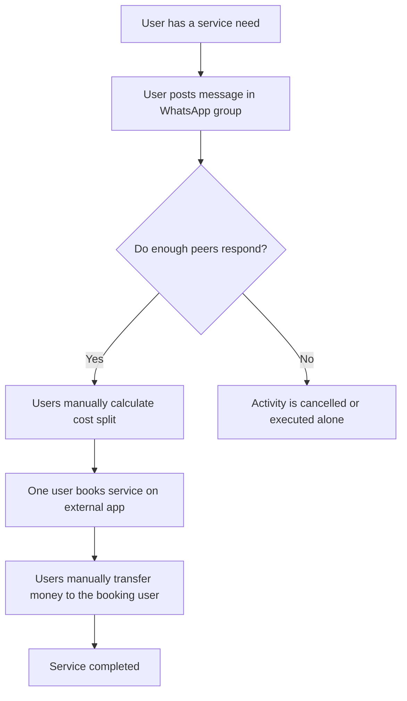
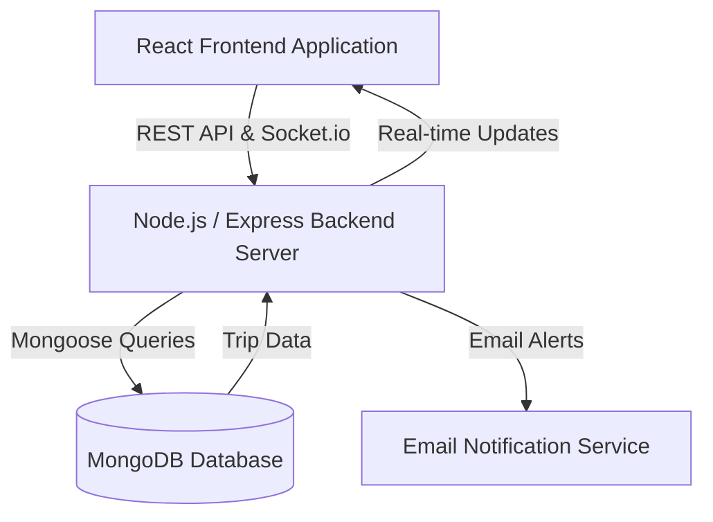
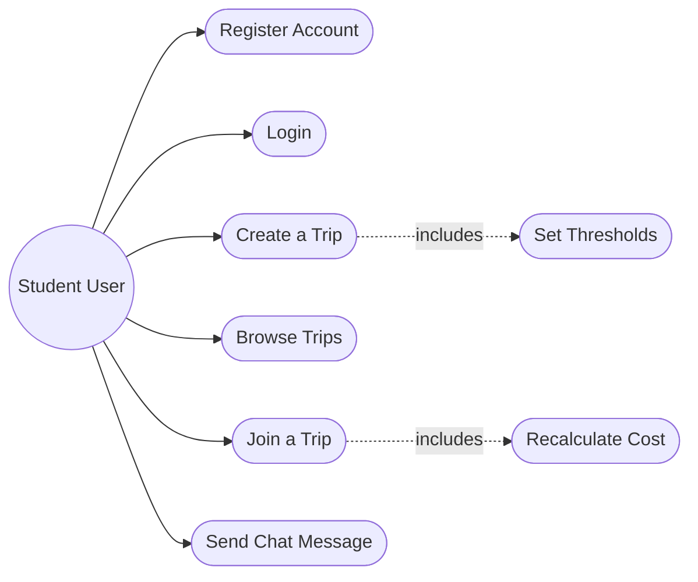
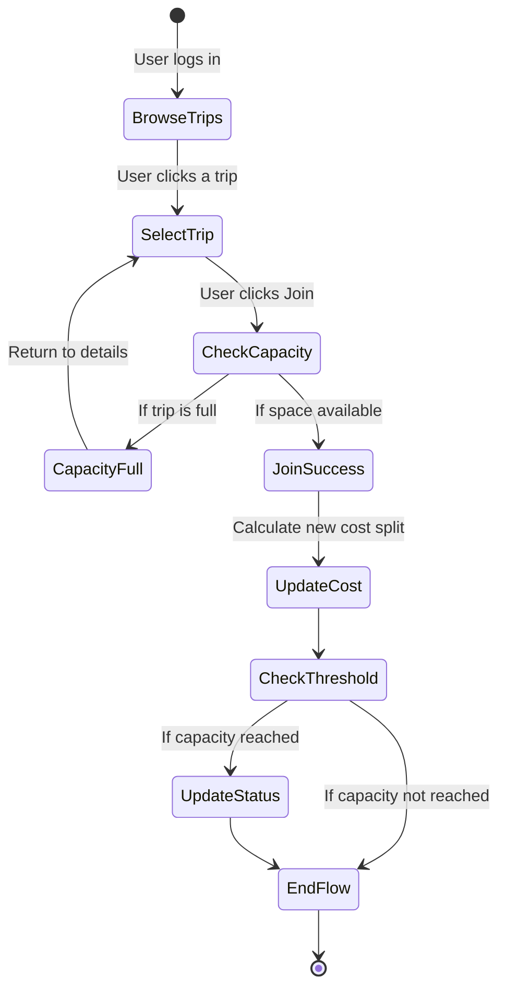
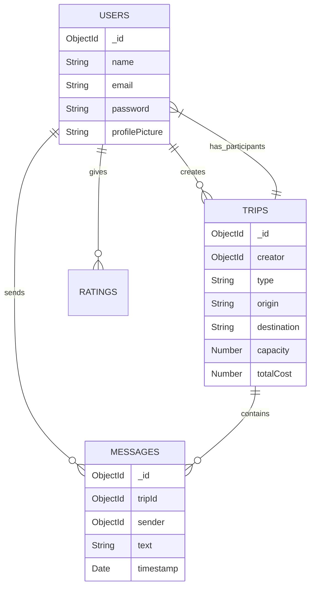

# CHAPTER THREE
# METHODOLOGY

## 3.1 Adopted Methodology
Agile Software Development methodology was selected for designing and implementing MoveTogether. Agile is an approach that builds software incrementally and promotes flexibility and continuous feedback throughout the development life cycle (Sommerville, 2016). Agile allows for overlapping development phases rather than requiring a strict sequential order (Pressman and Maxim, 2020). This methodology was chosen for this project for three specific reasons. First, MoveTogether consists of multiple interconnected modules including user authentication, real-time trip chat, threshold management, and a notification system. These components required continuous testing to ensure changes to one module did not break the functionality of others. Second, the platform targets students and young professionals who need highly usable interfaces. Agile allowed for regular interface updates based on user testing without requiring a complete redesign. Third, delivering working software in small increments aligns with the core principles of Agile and allowed for the early demonstration of core features like trip creation and joining (Beck *et al.*, 2001). The development process was divided into five sprints. Sprint One covered database configuration and user authentication. Sprint Two focused on the trip creation and discovery modules. Sprint Three implemented the cost-splitting calculation and threshold management features. Sprint Four built the real-time chat and notification system. Sprint Five covered system integration and deployment testing.

## 3.2 Analysis of the Existing System
The existing system analyzed for this study is WhatsApp. WhatsApp is a widely used messaging application that Nigerian university students and young professionals currently use to organize shared rides and group food orders. Eze *et al.* (2021) documented how students create informal chat groups to find peers heading to the same destination or ordering from the same restaurant. Users post their intentions in the chat and wait for others to respond. Once enough people agree to join, one person volunteers to book the service on Uber or Chowdeck and collects the money from the others. On the surface, this provides a basic way to coordinate shared activities. In practice, the platform lacks the structural features required to manage these transactions effectively. WhatsApp does not have any built-in tools for calculating cost splits, tracking who has paid, or managing participant limits. A student trying to organize a shared ride must manually calculate the fare divisions and track responses in a fast-moving chat thread. Hossain and Rahman (2020) confirmed this structural limitation, finding that unstructured messaging apps lead to information overload and frequently abandoned coordination attempts.

The process flow of using WhatsApp for informal group coordination is illustrated in Figure 3.1.

Figure 3.1: Process flow of the existing system (WhatsApp)

### 3.2.1 Limitations or Drawbacks of the Existing System
The following limitations of WhatsApp are identified in relation to the specific coordination needs of shared transport and group delivery users.
• No automated cost calculation. WhatsApp requires users to manually divide costs among participants. This often leads to errors and disagreements over unequal splits.
• No threshold management. A group ride or food order often requires a specific number of participants to be financially viable. WhatsApp cannot automatically close a group when a target number is reached or notify users when a minimum threshold is met.
• No structured discovery. Users must read through long chat histories to find relevant trips. There is no searchable database of available trips filtered by time or destination.
• High coordination fatigue. Organizing a shared activity on a messaging app requires constant communication. The effort required often discourages users from attempting to share services regularly.
• Payment disputes. Without a clear ledger of who joined and what they owe, organizers often struggle to collect funds from participants after the service is rendered.

## 3.3 Analysis of the Proposed System
MoveTogether is a web-based group coordination platform designed to solve the inefficiencies of informal messaging apps. The system provides a structured environment where users can create, discover, and join shared activities across four specific service types. These service types are Drive, Food, Dispatch, and Trek. The platform replaces disorganized chat threads with clear trip listings that automatically manage participant limits and cost calculations.

The system authenticates users through a secure login process. Authenticated users can navigate the dashboard to explore available trips or create their own. When creating a trip, a user specifies the origin, destination, time, maximum capacity, and estimated total cost. Other users can view these details and click a button to join the trip. The platform automatically recalculates the per-person cost every time a new member joins. The trip status updates dynamically from Open to Full once the capacity threshold is reached. Group members can then communicate through an integrated real-time chat module to finalize meeting points. This structured approach ensures that every user understands their financial commitment before the actual service booking takes place on an external platform.

### 3.3.1 Preliminary Design
The proposed system uses a client-server architecture consisting of a React frontend, a Node.js and Express backend, and a MongoDB database. The frontend communicates with the backend through REST API endpoints and uses JSON Web Tokens for authentication. Real-time communication for the chat module is handled by Socket.io. The backend processes user requests, updates the MongoDB database, and sends email notifications using Nodemailer.

When a user creates a trip, the React frontend sends the trip details to the Express backend. The backend validates the data and stores a new trip document in the MongoDB database. The system then broadcasts the new trip to all connected clients. When another user joins the trip, the backend verifies that the capacity has not been exceeded. It then adds the user to the trip participants array and updates the per-person cost. If the trip reaches full capacity, the backend changes the status to Full and prevents any further joins. The chat module opens a dedicated Socket.io room for the trip participants to exchange messages instantly.

The high-level architectural overview of the proposed system is illustrated in Figure 3.2.

Figure 3.2: Architectural overview of MoveTogether

### 3.3.2 Proposed System Justification
The proposed system provides better coordination capabilities than informal messaging apps. Table 3.1 presents a direct feature comparison between WhatsApp and MoveTogether.

Table 3.1: Feature Comparison between WhatsApp and MoveTogether
| Feature | WhatsApp (Existing) | MoveTogether (Proposed) |
| --- | --- | --- |
| Cost splitting | Manual calculation required | Automated equal-split calculation |
| Participant limits | No automatic enforcement | System enforces maximum capacity limits |
| Trip discovery | Manual search through chat logs | Filtered dashboard of available trips |
| Status tracking | Unclear and requires constant updates | Automated updates based on thresholds |
| Purpose | General messaging | Dedicated group service coordination |

Table 3.1 shows that WhatsApp lacks the specific tools needed for effective group service coordination. The proposed system provides automated features that remove the manual effort required to organize shared activities.

### 3.3.3 Benefits of the Proposed System
The key benefits of MoveTogether for its target users are listed below.
• Financial savings. The platform makes it easier for users to successfully coordinate shared services. This reduces the per-person cost of transportation and deliveries.
• Reduced coordination effort. The automated threshold management and cost calculation features remove the need for extensive back and forth messaging.
• Better visibility. Users can easily find available trips that match their schedule and destination instead of missing opportunities buried in busy chat groups.
• Improved accountability. The platform maintains a clear record of who joined a trip and what their expected financial contribution is. This reduces the likelihood of payment disputes.

## 3.4 System Design
The system design for MoveTogether is presented using Unified Modeling Language diagrams. These diagrams capture the structural and behavioral characteristics of the platform. The diagrams include a Use Case Diagram, an Activity Diagram, and an Entity Relationship Diagram.

### 3.4.1 Proposed System Modelling
The Use Case Diagram illustrates the primary interactions between the users and the system. It shows how an authenticated user can create trips, join trips, send messages, and manage their profile.

The Use Case Diagram is illustrated in Figure 3.3.

Figure 3.3: Use Case Diagram of MoveTogether

The Activity Diagram shows the step-by-step flow of joining a trip. It starts with the user browsing the dashboard and ends with the system updating the trip status and cost.

The Activity Diagram for joining a trip is illustrated in Figure 3.4.

Figure 3.4: Activity Diagram for joining a trip

The Entity Relationship Diagram illustrating the connections between collections is presented in Figure 3.5.

Figure 3.5: Entity Relationship Diagram of MoveTogether

## 3.5 Database Design
The proposed system uses MongoDB as its primary database. MongoDB is a NoSQL database that stores data in flexible document formats. This was selected because it works very well with the JavaScript-based backend and allows for quick iterations during development. The database schema is organized around four core collections. The summary of these collections is presented in Table 3.2.

Table 3.2: MoveTogether Database Schema Summary
| Collection Name | Key Fields | Description |
| --- | --- | --- |
| Users | _id, name, email, password, profilePicture, role | Stores authenticated user profiles and credentials |
| Trips | _id, creator, type, origin, destination, time, totalCost, capacity, status, participants | Stores all group intentions created by users |
| Messages | _id, tripId, sender, text, timestamp | Stores chat messages exchanged within specific trips |
| Ratings | _id, tripId, rater, ratee, score, comment | Stores user feedback submitted after a trip is completed |

Table 3.2 shows the collections that form the database of MoveTogether. The Trips collection is the central component because it links users together and holds all the data required for threshold management.

## 3.6 Input/Output Specification
The input and output specification defines what data the system accepts from users and what outputs it produces. Table 3.3 presents the main input and output requirements for the core system functions.

Table 3.3: Input/Output Specification of MoveTogether
| Function | Input | Output |
| --- | --- | --- |
| User Registration | Full name, email address, password | User profile created in database, JSON Web Token generated |
| User Login | Email address, password | JSON Web Token generated, dashboard access granted |
| Trip Creation | Service type, origin, destination, time, cost, capacity | Trip record saved in database, trip appears on dashboard |
| Trip Joining | Selected trip ID | User added to participants array, per-person cost recalculated |
| Chat Messaging | Text content, trip ID | Message saved in database, broadcasted to other participants |

Table 3.3 demonstrates that every user action requires specific inputs and generates verifiable outputs. This ensures that the platform functions reliably during everyday use.

## 3.7 Cost Analysis
The development of MoveTogether relied primarily on open-source frameworks and free-tier services. This approach minimized the initial financial investment required to build the platform. Table 3.4 details the cost components for the development and local deployment of the system.

Table 3.4: Cost Analysis of MoveTogether Development
| Component | Tool or Service | Cost |
| --- | --- | --- |
| Frontend Framework | React (open source) | Free |
| Backend Framework | Node.js and Express (open source) | Free |
| Database | MongoDB Atlas (free tier) | Free |
| Real-time Communication | Socket.io (open source) | Free |
| Development Environment | Visual Studio Code | Free |
| Version Control | Git and GitHub | Free |
| Total Development Cost | | ₦0.00 |

Table 3.4 shows that the entire technology stack was assembled using free tools. This zero-naira development cost ensures that the platform is economically viable to build and maintain. Future production deployments will require paid server hosting, but this falls outside the scope of the current local development phase.
